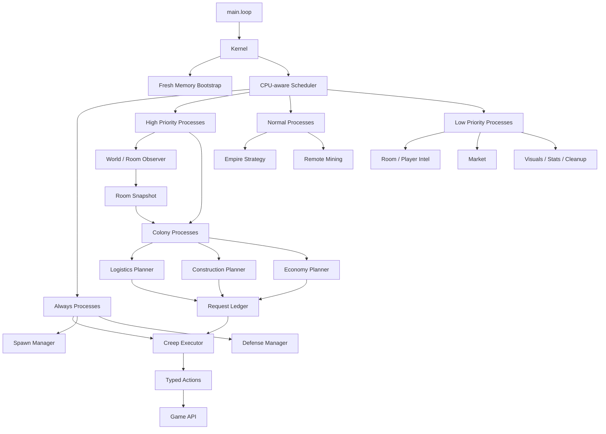

# Screeps Bot V2 架构重构设计

> 状态：V2 首批骨架已落地
>
> 目标：放弃旧版 `Scanner + global Task + role switch` 组织方式，重建一套以 Tick Kernel、CPU 调度、殖民地领域模型和分层 Memory 为核心的 Screeps Bot。

## 1. 重构决策

这次重构采用“大刀阔斧”的策略，不把旧目录继续当作新架构的边界，也不为旧的 `Scanner`、`Task`、`role`、`behavior` 设计兼容接口。

旧版本只保留为以下用途：

- 记录当前已经实现的游戏行为；
- 作为重构后行为回归时的参考；
- 在 Git 中保留一个 `legacy-v1` 标签或分支。

新版本的运行入口、Memory schema、Tick 调度器和领域模型全部重新设计。V2 不读取、不转换、不兼容旧版 Memory；旧源码也不进入新入口的运行链路。

这是一次全量切换，不是渐进迁移。部署 V2 前由操作者手动清空旧 Memory，并清理旧版 Creep；V2 只从空白 schema 初始化。代码不会自动删除线上数据，也不会尝试猜测旧字段的含义。

## 2. 设计目标

### 2.1 必须达到

- `main.loop` 只负责启动 Kernel，不直接承载所有业务逻辑；
- 观察、规划、执行三类逻辑分离；
- 所有周期任务可声明运行间隔、优先级、最低 CPU bucket 和 Segment 依赖；
- Creep 行为由显式 Executor 驱动，不再通过 `Creep.prototype.run` 隐式挂载；
- Memory 只保存 JSON 数据、ID、压缩坐标和必要的业务状态；
- 每个房间有独立的 Colony 生命周期，不依赖全局数组互相扫描；
- 任务系统从“所有 Creep 的动作列表”升级为“房间需求账本 + Creep 本地执行状态”；
- 所有 Memory 变更有 schema 版本；schema 不匹配时直接建立新的默认结构，不执行旧数据迁移；
- 在 CPU 紧张时能够主动降级，而不是等待脚本被终止；
- 大数据放入 RawMemory Segments 前，先有大小监控和清理策略。

### 2.2 明确不做

- 第一阶段不实现完整 Overmind 级别的自动扩张、战斗和市场系统；
- 第一阶段不引入自定义 Memory 序列化和压缩算法；
- 不把 `Room`、`Creep`、`Structure`、`ConstructionSite` 等运行时对象写进 Memory；
- 不使用一个全局任务数组承载所有房间的所有行为；
- 不为了抽象而抽象出大量 `BaseManager`、`BaseRole` 和空接口；
- 不把所有业务都强制建模为长期 Process，简单动作应保持简单。

## 3. 公开项目调研结论

### 3.1 TypeScript Starter

[screepers/screeps-typescript-starter](https://github.com/screepers/screeps-typescript-starter) 主要解决 TypeScript 类型、Rollup 打包、代码上传和最小入口问题。它强调让 `main.ts` 保持空而简单，因此适合借鉴构建基础，不作为本项目的业务架构模板。

### 3.2 Overmind

[bencbartlett/Overmind](https://github.com/bencbartlett/Overmind) 展示了大型 Screeps Bot 的领域拆分方式：高层负责殖民地和战略，殖民地内部由不同的 Overlord 管理具体资源和 Creep 执行单元。它适合作为 Colony、Strategy、Executor 的设计参考，但完整复制会把当前项目直接带入过度复杂的成熟 Bot 体系。

### 3.3 Hivemind

[Mirroar/hivemind](https://github.com/Mirroar/hivemind) 是本项目最重要的参考对象。它的 [主循环](https://github.com/Mirroar/hivemind/blob/master/src/main.ts) 先处理 Memory、迁移、清理和 Segment，再按优先级和间隔运行不同 Process；[Kernel](https://github.com/Mirroar/hivemind/blob/master/src/hivemind.ts) 负责 CPU 统计、Process 调度、降级和错误边界；[Segmented Memory](https://github.com/Mirroar/hivemind/blob/master/src/utils/segmented-memory.ts) 负责把大数据从普通 Memory 中分离出来。

本项目采用 Hivemind 的思想，但只实现一个小型版本：先做 Kernel、Scheduler、全新 Memory Bootstrap 和 Colony Process，不复制其全部功能。

### 3.4 官方运行约束

[Screeps Global Objects 文档](https://docs.screeps.com/global-objects.html) 明确说明 Memory 以 JSON 形式持久化，容量限制为 2 MB；首次访问 Memory 时需要解析存储字符串；游戏对象不应直接保存到 Memory，应该保存 ID 后再通过 `Game.getObjectById` 获取。

[RawMemory API](https://docs.screeps.com/api/#RawMemory) 提供了 0 到 99 的异步 Segment，每个 Segment 最大 100 KB，同时最多激活 10 个。Segment 数据需要跨 Tick 请求，因此不能把它当成同步数据库使用。

[CPU 文档](https://docs.screeps.com/cpu-limit.html) 说明 CPU bucket 可以为单个 Tick 提供额外执行额度，`Game.cpu.tickLimit` 会随 bucket 状态变化。因此调度器必须能够根据 bucket 和当前 CPU 主动降低低优先级工作量。

[Caching Overview](https://docs.screeps.com/contributed/caching-overview.html) 区分了持久化 Memory 和可能被重置的 Global/Heap：昂贵但稳定的数据可以缓存，临时对象缓存必须允许随时丢失，并且要记录 TTL 或版本以处理陈旧数据。

## 4. 目标总体架构



核心数据流是：

```text
Game 当前状态
  -> Observer 观察
  -> Snapshot / Intel
  -> Colony / Empire Planner
  -> Request Ledger
  -> Creep Executor
  -> Game API Action
```

Observer 不直接建造、攻击或生产；Planner 不直接调用 Creep 行为；Executor 才是产生游戏操作的边界。

## 5. 代码分层

```text
src/
├── main.ts
└── v2/
    ├── core/
    │   ├── kernel.ts
    │   ├── scheduler.ts
    │   ├── process.ts
    │   └── tick-context.ts
    ├── memory/
    │   ├── schema.ts
    │   └── store.ts
    ├── world/observer/
    │   └── room-observer.ts
    ├── empire/
    │   ├── empire-process.ts
    │   ├── colony-process.ts
    │   ├── spawn-process.ts
    │   └── defense-process.ts
    ├── creeps/
    │   ├── executor.ts
    │   └── actions.ts
    └── types/global.d.ts

# 后续扩展目录
v2/strategy/          # 扩张、远程采矿、市场
v2/infrastructure/    # 统计、Visual、控制台和日志
```

### 5.1 Core

Core 只负责 Tick 生命周期、Process 调度、CPU 控制、错误隔离和上下文，不负责具体房间业务。

### 5.2 World

World 只负责从 `Game` 读取事实，输出可供 Planner 使用的快照和 Intel。它不直接改变游戏状态。

### 5.3 Empire / Colony

Empire 负责跨房间战略和全局资源；Colony 负责单个自有房间的生产、能源、物流、建筑和防御。所有房间级业务都通过 Colony 进入，不允许每个角色自己全量扫描整个世界。

### 5.4 Creeps

Creep Executor 根据 CreepMemory 和 Request Ledger 选择动作。动作函数只处理一个有限目标，例如 `harvest`、`withdraw`、`transfer`、`build`、`repair`、`upgrade`。

不再给 `Creep.prototype` 挂载 `run()`。入口显式调用：

```ts
for (const creep of Object.values(Game.creeps)) {
  creepExecutor.run(creep);
}
```

## 6. Tick 生命周期

```text
1. Kernel bootstrap
2. Memory schema 初始化
3. 恢复 Heap cache / Global cache
4. 清理死亡 Creep、过期请求和过期 Intel
5. 管理 RawMemory Segments
6. Always Process：防御、Spawn、Creep 当前动作
7. High Process：房间观察、能源物流、殖民地关键状态
8. Normal Process：建造、布局、远程和经济规划
9. Low Process：市场、统计、Visual、远期 Intel
10. 记录 CPU、bucket、Process 执行结果
```

建议的优先级：

| 优先级 | 典型任务 | CPU 紧张时的策略 |
| --- | --- | --- |
| Always | Creep 执行、紧急防御、Spawn | 不主动跳过 |
| High | 房间观察、物流、关键维修 | 减少扫描范围 |
| Normal | 建造规划、道路、远程采矿 | 增大 interval |
| Low | 市场、统计、Visual、清理 | 直接跳过 |

Process 至少需要支持：

```ts
interface ProcessOptions {
  interval?: number;
  priority?: "always" | "high" | "normal" | "low";
  minBucket?: number;
  requireSegments?: boolean;
  maxCpu?: number;
}
```

同一个 Process 不应该用 `Game.time % 20` 散落在业务代码中。所有调度间隔统一交给 Scheduler 管理。

## 7. Memory 设计

### 7.1 Memory 归属

| 位置 | 存储内容 | 禁止内容 |
| --- | --- | --- |
| `Memory.bot` | schema、Kernel、全局设置、Empire 注册表、运行统计 | 实时 Game 对象 |
| `Memory.lastModified` | 当前上传代码的构建时间标识 | 每 Tick 递增的运行计数 |
| `Memory.rooms[roomName]` | 房间稳定事实、规划状态、请求账本 | 完整 Structure、ConstructionSite 数组 |
| `Memory.creeps[name]` | 角色、home、当前 action、目标 ID | 完整 Creep、路径对象、实时统计快照 |
| `Memory.flags` | 手动控制和调试开关 | 大型历史数据 |
| Heap / Global | 当前 Tick 对象索引、缓存、CostMatrix | 需要永久保留的数据 |
| RawMemory Segments | 远程 Intel、长期路径、大型统计 | 每 Tick 必须同步读取的数据 |

### 7.2 全局 Memory Schema

```ts
interface BotMemory {
  schemaVersion: number;
  botVersion: string;

  kernel: {
    lastTick: number;
    processes: Record<string, ProcessMemory>;
  };

  settings: {
    mode: "normal" | "safe" | "maintenance";
    visuals: boolean;
    debug: boolean;
  };

  empire: {
    ownedRooms: string[];
    remoteRooms: string[];
    primaryRoom?: string;
  };

  migration: {
    running: boolean;
    fromVersion?: number;
    cursor?: string;
  };
}

interface ProcessMemory {
  lastRun: number;
  lastCpu?: number;
  runCount?: number;
  errorCount?: number;
}
```

### 7.3 Room Memory Schema

```ts
interface ColonyRoomMemory {
  schemaVersion: number;
  kind: "owned" | "remote" | "intel";
  roomName: string;

  static: {
    controllerId?: string;
    spawnIds: string[];
    sources: Record<string, SourceMemory>;
    mineralId?: string;
  };

  state: {
    controllerLevel?: number;
    lastObserved: number;
    lastPlanned: number;
    threatLevel: number;
  };

  planner: {
    layoutVersion?: string;
    roadVersion?: string;
    nextRun: number;
  };

  requests: Record<string, RequestMemory>;
}

interface SourceMemory {
  sourceId: string;
  containerId?: string;
  linkId?: string;
  minerName?: string;
  packedPosition?: number;
}
```

`packedPosition` 可以把房间内坐标编码成 `x * 50 + y`，跨房间坐标必须额外保存 `roomName`。路径优先使用 `Room.serializePath()`，不要保存完整路径对象。

### 7.4 Creep Memory Schema

```ts
interface BotCreepMemory {
  schemaVersion: number;
  role: "worker" | "harvester" | "carrier" | "defender" | "scout";
  homeRoom: string;
  bornAt: number;

  action?: {
    kind: "harvest" | "withdraw" | "transfer" | "build" | "repair" | "upgrade" | "renew" | "wait";
    targetId?: string;
    sourceId?: string;
    requestId?: string;
    roomName?: string;
  };

  route?: {
    destinationRoom?: string;
    serializedPath?: string;
  };
}
```

### 7.5 Memory 硬规则

禁止写入：

```ts
Memory.rooms[roomName].repairTargets = room.find(FIND_STRUCTURES);
Memory.rooms[roomName].constructionSites = room.find(FIND_CONSTRUCTION_SITES);
creep.memory.target = structure;
```

允许写入：

```ts
Memory.rooms[roomName].repairTargetIds = targets.map(target => target.id);
creep.memory.action = {
  kind: "transfer",
  targetId: structure.id,
};
```

实时列表如果只服务于当前 Tick，就放在 Heap cache，不要放入 Memory。稳定事实才进入 Memory，超过普通 Memory 预算的数据才进入 Segment。

## 8. Request Ledger 任务模型

旧版 `Memory.taskList` 同时承担任务定义、分配、状态和执行上下文，导致不同房间之间互相污染。新架构拆成两层。

### 8.1 Creep Action

这是 Creep 自己的短期状态，例如：

- 当前正在采集哪个 Source；
- 当前正在把资源送到哪个 Extension；
- 当前正在维修哪个建筑；
- 当前是否需要等待。

它只保存在 `Memory.creeps[name].action`，失败后由 Executor 重新选择。

### 8.2 Room Request

这是房间对资源和执行能力的需求，例如：

```ts
interface RequestMemory {
  id: string;
  kind: "withdraw" | "transfer" | "refill" | "build" | "repair";
  roomName: string;
  sourceId?: string;
  targetId?: string;
  resourceType?: ResourceConstant;
  amount: number;
  priority: number;
  createdAt: number;
  expiresAt?: number;
  assignedCreeps: string[];
}
```

请求 ID 应该稳定且可去重，例如：

```text
refill:tower:E13S39
refill:spawn:E13S39
repair:critical:E13S39
```

一个请求可以被多个 Creep 分段完成；一个 Creep 同一时间只拥有一个主 Action。请求由 Colony 的 Logistics、Construction 或 Defense Planner 产生，不能由 Creep 行为函数直接向全局数组追加。

## 9. Process 设计示例

```ts
class ColonyProcess implements Process {
  constructor(private readonly roomName: string) {}

  run(context: TickContext): void {
    const room = Game.rooms[this.roomName];
    if (!room) return;

    const snapshot = context.world.observeRoom(room);
    const plan = context.colonies.plan(this.roomName, snapshot);
    context.requests.apply(plan.requests);
  }
}
```

Creep 执行器只消费请求和自己的状态：

```ts
class CreepExecutor {
  run(creep: Creep): void {
    const action = this.actionResolver.resolve(creep);
    const result = this.actions.execute(creep, action);

    if (result.kind === "completed" || result.kind === "invalid") {
      this.memory.clearAction(creep);
    }
  }
}
```

Action 需要返回明确结果：

```ts
type ActionResult =
  | { kind: "running" }
  | { kind: "completed" }
  | { kind: "blocked"; reason: string }
  | { kind: "invalid"; reason: string };
```

不要让行为函数通过递归调用 `taskRunner()` 立即重选任务。一次 Tick 只做一次有限动作，下一 Tick 根据结果重新规划，避免隐式递归和重复调用 Game API。

## 10. 全新 Memory 初始化

V2 不提供 `v1 -> v2` 迁移器，也不把旧版 Memory 当作输入。`Memory.bot`、`Memory.rooms` 和 V2 CreepMemory 缺失或 schema 不匹配时，直接创建默认结构；旧字段被忽略。

### 10.1 上线前手动操作

在 Screeps 控制台执行一次人工重置，再上传 V2：

```js
Memory = {}
```

同时删除旧版 Creep，避免旧 Creep 携带的旧 `CreepMemory` 被误认为 V2 数据。该步骤是有意的破坏性切换，执行前应由操作者确认当前房间不再需要旧 Bot 接管。

### 10.2 V2 初始化边界

- 根对象：`Memory.bot.schemaVersion === 2`；
- 房间对象：只写入 ID、短状态、时间戳和请求账本；
- Creep 对象：只接受 `schemaVersion === 2` 的新任务状态；
- 旧版 `Memory.taskList`、完整 Game 对象和旧角色字段不参与 V2 运行；
- 大数据只有在后续 Segment Manager 明确启用后才进入 Segment。

初始化伪代码：

```ts
export function ensureBotMemory(): BotMemory {
  if (!Memory.bot || Memory.bot.schemaVersion !== CURRENT_SCHEMA_VERSION) {
    Memory.bot = createDefaultBotMemory();
  }
  return Memory.bot;
}
```

## 11. 大刀阔斧的实施策略

### Phase 0：建立基线

- 当前代码打标签 `legacy-v1`；
- 记录当前可运行行为和已有 Memory 字段；
- 由操作者确认并手动清空线上旧 Memory；
- 新建 V2 架构文档、目录和测试约定；
- 禁止继续向旧 `Scanner` 和旧 `Task` 增加功能。

### Phase 1：替换运行骨架

直接替换 `main.ts` 的入口组织方式：

- 新增 Kernel；
- 新增 Scheduler；
- 新增 Memory Bootstrap；
- 新增 Error Boundary；
- 新增 Stats 和 CPU 监控；
- 旧逻辑不注册为 Process，不再由 main 直接调用；旧源码只作为本地参考。

### Phase 2：替换 Memory

- 建立 `Memory.bot`；
- 建立 schema 类型；
- schema 不匹配时直接初始化默认值；
- 清理完整 Game 对象；
- 将实时列表从 Memory 移到 Heap；
- 统一 Creep Action 结构。

### Phase 3：重建单房间 Colony

只先实现一个自有房间：

- Room Observer；
- Source/Container 绑定；
- Spawn Manager；
- Harvester Executor；
- Worker Executor；
- 基础能源 Request Ledger。

这一阶段的验收目标不是功能最多，而是能够证明新的 Tick、Memory、请求和执行链路成立。

### Phase 4：完善生产和物流

- Carrier；
- Spawn/Extension/Tower refill；
- Storage withdraw/deposit；
- 建造和维修请求；
- 请求过期、重新分配和死亡 Creep 清理。

### Phase 5：完善防御和规划

- 防御状态机；
- 建筑规划；
- 道路规划；
- Room Visual；
- 多房间 Colony 管理。

### Phase 6：战略和大型数据

- 远程采矿；
- 房间 Intel；
- 市场；
- Segment Manager；
- 跨 Shard 数据；
- 战斗和扩张策略。

## 12. 旧代码处理原则

以下模块不再作为 V2 的设计基础：

```text
src/modules/Scanner.ts
src/modules/Task.ts
src/modules/autoCreate.ts
src/modules/mount.ts
src/modules/global.ts
src/task/run.ts
src/role/*
src/behavior/*
```

它们可以在 `legacy-v1` 标签中保留，也可以在重构分支中移动到 `legacy/` 供对照，但新入口不得继续 import 它们。

明确删除的旧模式：

- `Creep.prototype.run`；
- 一个文件负责扫描、规划和执行；
- 全局 `Memory.taskList`；
- 通过 `targetId` 全局去重任务；
- 把完整 Game 对象写入 Memory；
- 每个行为文件自己全量扫描整个房间；
- 通过 `Game.time % N` 在业务代码中散落调度；
- 递归重入 `taskRunner`；
- 用 `global` 作为永久数据存储。

## 13. 验收标准

### 架构验收

- `main.ts` 不包含房间业务判断；
- 所有周期任务注册在 Scheduler；
- Observer 不调用建造、攻击、生产等副作用 API；
- Planner 不直接操作 Creep；
- Executor 是 Game 写操作的主要入口；
- 多个房间之间不存在共享可变任务数组。

### Memory 验收

- `RawMemory.get().length` 有监控；
- 普通 Memory 不保存完整 Game 对象；
- Creep、Room、Bot schema 都有版本号；
- 死亡 Creep、过期请求、过期房间 Intel 能自动清理；
- V2 在空白 Memory 上可重复初始化，不读取旧版数据；
- Segment 未加载时，依赖 Segment 的 Process 不执行。

### 运行验收

- 低 bucket 时低优先级 Process 自动暂停；
- 单个房间异常不会让所有房间停止；
- Spawn、Creep 执行和紧急防御始终有明确 CPU 预算；
- 全局重置后 Bot 可以从 Memory 恢复；
- Rollup 能稳定生成单文件 `dist/main.js`；
- 需要手动上传或部署，不把线上上传绑定到普通 build。

## 14. 第一批落地任务

第一批代码不兼容旧角色，而是先建立新的骨架：

1. `src/v2/core/kernel.ts`
2. `src/v2/core/scheduler.ts`
3. `src/v2/core/process.ts`
4. `src/v2/core/tick-context.ts`
5. `src/v2/memory/schema.ts`
6. `src/v2/memory/store.ts`
7. `src/v2/world/observer/room-observer.ts`
8. `src/v2/empire/empire-process.ts`
9. `src/v2/creeps/executor.ts`
10. 新版 `src/main.ts`

第一批完成后，旧代码可以完全不参与运行，只保留在 Git 历史中作为行为参考。之后直接在 V2 Colony 中逐步完善 Harvester、Worker、Carrier、Spawn 和 Defense。

## 15. 参考资料

- [Screeps Global Objects](https://docs.screeps.com/global-objects.html)
- [Screeps RawMemory API](https://docs.screeps.com/api/#RawMemory)
- [Screeps CPU Limit](https://docs.screeps.com/cpu-limit.html)
- [Screeps Caching Overview](https://docs.screeps.com/contributed/caching-overview.html)
- [Screeps TypeScript Starter](https://github.com/screepers/screeps-typescript-starter)
- [Overmind](https://github.com/bencbartlett/Overmind)
- [Hivemind](https://github.com/Mirroar/hivemind)
- [The International Open Source Bot](https://github.com/The-International-Screeps-Bot/The-International-Open-Source)
- [TooAngel Screeps Bot](https://github.com/TooAngel/screeps)

## 16. 游戏知识层与低 Token 上下文

Screeps API 事实、成熟 Bot 参考和 Agent 上下文路由已单独沉淀到 [Screeps 知识层与策略资料调研](./screeps-knowledge-layer.md)。实现新策略前只读取相关小节，不把完整游戏手册、第三方 README 或旧版源码全量放入上下文。

项目级策略 Skill 位于 `.agents/skills/screeps-strategy/SKILL.md`，负责在 API 事实、策略设计、架构实现和行为回归之间选择最小上下文范围。Context7 的 Screeps 索引使用 `/websites/screeps`，具体 API 查询仍需以官方文档和当前游戏版本为准。

## 17. 部署确认标识

每次 Rollup 编译会生成一个构建时间字符串。Screeps 加载 bundle 时，入口模块会立即写入顶级 `Memory.lastModified`；V2 Kernel 每 Tick 再写入同一个值，用于确认主循环持续执行。部署后在实际运行代码的 Screeps 分支和 shard 控制台检查：

```js
Memory.lastModified
```

如果值没有变化，说明当前分支没有执行新 bundle；如果值变化但房间没有行为，继续检查 `Memory.bot.kernel.processes`、Creep 是否为 `schemaVersion === 2`，以及 Spawn/CPU 状态。

`pnpm run build` 只编译，`pnpm run push` 执行一次线上编译并等待上传完成，`pnpm run push:local` 执行一次本地服务器上传，`pnpm run push:watch` 才是持续监听线上上传。上传成功会打印目标地址、branch 和文件数；上传失败会让命令以非零状态退出。`pnpm run local` 仍是本地服务器的持续监听上传，但本地 Screeps 服务必须由操作者先启动。
