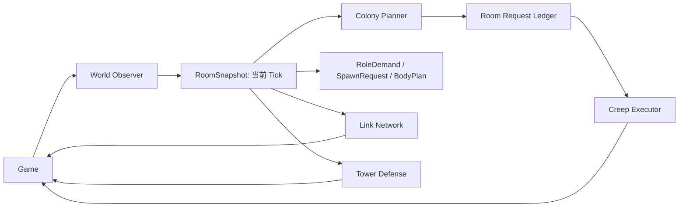

# Screeps 单房间经济架构

## 目标与边界

本版本是一次硬切换：只运行 `schemaVersion === 3` 的 Memory 与 Creep，不读取、不转换旧字段。代码不会清空线上 Memory 或删除 Creep；上线前由操作者在 Screeps 控制台完成重置。

首版只覆盖自有房间的自举、Container/Link 物流、动态生产、补能、建造、维修、升级和塔防。不包含外矿、跨房间物流、市场、自动扩张或战斗 Creep。

## Tick 数据流



Kernel 固定按以下顺序运行：观察、房间规划、Link 网络、生产、塔防、Creep 执行。Scheduler 统一负责运行顺序、间隔、CPU bucket 和错误隔离。

## 目录

```text
src/
  core/       Kernel、Scheduler、TickContext
  memory/     schema 3 与持久化访问
  world/      RoomSnapshot 与观察器
  colony/     请求规划、角色需求、生产、Link、塔防
  creeps/     一次动作执行器
  runtime/    构建标识
  types/      Memory 与领域类型
```

## Memory 规则

`Memory.bot` 保存 Kernel 状态和自有房间列表；`Memory.rooms[roomName]` 保存 Source、Container、Link、Storage 的 ID/坐标和请求账本；`Memory.creeps[name]` 保存角色、home、Source 绑定与短期动作。

Creep 名称使用 `角色-房间-Game.time`，例如 `pioneer-E13S39-12345`；名称不承载 Schema 或架构版本，兼容性只由 Memory 的 `schemaVersion` 判断。

禁止写入 `Room`、`Creep`、`Structure`、`Source`、完整路径或其他运行时对象。`RoomSnapshot` 只存在当前 tick，通过 `Game.getObjectById` 按 ID 恢复游戏对象。

## 资源闭环

1. RCL1 使用 Pioneer：Observer 每 tick 枚举每个 Source 周围实际可站立的相邻格；每个格是一个独立采集位，Spawn 为每个 Pioneer 分配 Source 与坐标。多个 Pioneer 可以同时采集同一 Source，但不会争用同一格。Container 位置从这些格中选择到 Spawn 交能范围实际路径成本最低的一格；携带能量时先建造自己绑定 Source 旁的 Container，完成或目标失效后才回退到房间请求账本。
2. Container 完成后，每个 Source 有固定 Miner。Miner 站在 Container 上，采至自身容量阈值后转入 Source Link 或 Container。
3. Hauler 从 Source Container 取能量，优先满足 Spawn/Extension、再满足 Tower；无补能需求时转入 Storage。
4. Worker 从 Storage 优先、Container 其次取能量，按补能、建造、维修、升级请求执行。
5. Source Link 与 Storage 附近 Link 同时存在时，Link Network 优先传能，Hauler 处理未被 Link 覆盖的流量。

请求在每 tick 根据快照更新，具有稳定 ID、优先级、数量、过期时间和 Creep 预约。Executor 每 tick 最多做一个动作；目标失效、资源耗尽或容量满时清理动作，等待下一 tick 重规划。

## 验收

静态检查依次执行：`pnpm run build`、`./node_modules/.bin/tsc --noEmit`、`node --check dist/main.js`、`git diff --check`。

真实运行由操作者手动启动和上传后验证：空白 Memory 初始化、RCL1 自举、Container 建设、Miner 固定矿点、Hauler 缓存运输、优先级补能、Container/目标失效后的重规划。检查 `Memory.lastModified`、`Memory.bot.kernel.processes`、房间请求和 Creep 动作以区分构建成功与 tick 行为成功。
