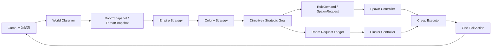

# Screeps Bot 发展与控制策略

> 状态：策略基线
>
> 定位：吸收 Overmind 的殖民地控制思想，结合 Hivemind 的 Kernel/Process 调度，形成适合本项目的分阶段自动发展策略。

## 1. 总体目标

本 Bot 不是一组固定角色脚本，而是一个持续运行的殖民地控制系统。它每个 Tick 观察世界，判断殖民地所处阶段和健康度，选择当前最重要的战略目标，再把目标转换成房间请求、角色需求、身体方案和一次 Tick 的执行动作。

核心闭环如下：

控制系统必须保证：战略目标不会直接操作 Creep，观察器不会产生副作用，Creep 不会自己创建全局任务；所有行为都通过房间级需求和显式执行器完成。

## 2. Overmind 风格的领域映射

本项目借鉴 Overmind 的层次，但使用更小的模型，避免为了形式复制完整的 Overmind。

| 本项目概念 | Overmind 对应概念 | 职责 |
| --- | --- | --- |
| Empire Strategy | Overmind / Overseer | 管理房间组合、扩张目标、全局资源和战略模式 |
| Colony Strategy | Colony | 管理一个自有房间的阶段、健康度、生产和生存 |
| Cluster Controller | HiveCluster / Overlord | 管理矿点、孵化区、升级区、物流区或防御区 |
| Directive | Directive | 表达扩张、远程采集、防守、复活等条件性目标 |
| Room Request | Logistics request | 表达房间需要多少资源或执行能力 |
| Creep Action | Task | 表达单个 Creep 当前 Tick 或短期要执行的动作 |
| Creep Executor | Zerg runner | 将 Action 转换成一个 Screeps API 调用 |

### 2.1 Empire Strategy

Empire Strategy 只处理跨房间问题：房间是否应该继续升级、是否准备远程采集、是否允许扩张、哪个房间需要资源支援，以及当前处于 `normal`、`safe`、`recovery` 或 `expansion` 模式。

Empire Strategy 不直接调用 `spawnCreep`、`harvest`、`build` 或 `attack`。它只产生战略 Directive 和房间级目标。

### 2.2 Colony Strategy

每个自有房间都有独立的 Colony Strategy。它维护房间阶段、健康度和能力缺口，并将战略目标转换为 `RoleDemand`、`SpawnRequest` 和 `RoomRequest`。

Colony Strategy 必须能够在房间受到攻击、Creep 大量死亡、Container 失效或 Controller 即将降级时，暂时放弃普通发展，进入恢复或防守阶段。

### 2.3 Cluster Controller

Cluster 是空间或功能相近对象的控制单元，不是长期保存的 Game 对象。首批 Cluster 包括：

- `SourceCluster`：Source、采集位、Container/Link、Miner 和上游物流。
- `HatcheryCluster`：Spawn、Extension、Tower、补能请求和生产请求。
- `UpgradeCluster`：Controller、Upgrader 和升级储备。
- `ConstructionCluster`：建筑工地、维修目标和布局计划。
- `DefenseCluster`：敌情、Tower、Rampart、受伤 Creep 和防守请求。

Cluster Controller 负责本领域的需求生成和 Creep 协调，但不能绕过 Request Ledger 直接操纵其他领域的 Creep。

## 3. 发展阶段策略

发展阶段是战略状态机，不以单一 RCL 数字作为唯一判断。RCL、GCL、能源吞吐量、威胁、CPU 和请求积压共同决定阶段。

### Stage 0：Bootstrap

目标是让房间活下来并建立最小能源闭环。

- 使用 Pioneer 完成采集、补能、Container 工地建设和必要升级。
- Spawn 保留自救预算；没有活动 Creep 时优先生成最小 Pioneer 或 Miner。
- 不启动远程采集、市场、复杂布局或扩张规划。
- Container 建成后，立即为对应 Source 生成固定 Miner 需求，其他未完成 Source 继续由 Pioneer 自举。

退出条件：每个可用 Source 都有稳定采集方案，Spawn 不再频繁断能，房间能够持续生产至少一个核心角色。

### Stage 1：Stable Economy

目标是把“采集能量”变成可预测的房间吞吐量。

- 每个 Source 由固定 Miner 负责，Miner 不在背包满后携能往返基地。
- Hauler 按运输距离、缓存容量和基地需求补足物流能力。
- Hatchery 优先满足 Spawn/Extension；普通情况下再满足 Tower、Construction 和 Upgrade。
- Upgrader 独占普通 Controller 升级职责，Worker 不长期挤占升级工作。
- RoleDemand 根据 Source 数量、Container 状态、运输距离和请求积压生成，不使用固定人口常量。

退出条件：Source 缓存不会长期满载，Spawn/Extension 不会因物流短缺停摆，Controller 有持续升级能力。

### Stage 2：Infrastructure and Defense

目标是把房间从“能运行”提升为“能承受波动”。

- 优先完成 Tower、Storage、Link、道路和关键 Rampart 等基础设施。
- Hostile 存在时，Defense Cluster 取得最高控制优先级；Tower 能量、己方受伤 Creep 和关键建筑分别建模。
- Link Network 在适用时承担 Source 到基地的高频能量转移，Hauler 处理 Link 覆盖不到的流量。
- 建筑规划只在 CPU 和能源有余量时运行，不得影响 Spawn、Defense 和当前 Creep Action。

退出条件：房间有稳定库存、基础防守能力和可恢复的生产链路，短期敌情不会直接导致经济崩溃。

### Stage 3：Remote Ready

目标是为跨房间经济做准备，而不是立即最大化扩张。

- 建立房间 Intel、路线成本、外部 Source、敌方活动和远程房间风险评估。
- 只有本房间没有紧急降级风险、核心请求积压可控、Spawn 有备用生产能力时，才允许远程采集。
- 远程任务必须独立拥有 reserver、remote miner、carrier 和撤退条件。
- 外部房间失联、敌情上升或物流收益低于阈值时，自动撤销或暂停 Directive。

退出条件：至少一条远程链路可以在不影响主房间的情况下持续运行，并且远程失败后主房间仍能自救。

### Stage 4：Expansion

目标是增加殖民地数量，而不是单纯增加房间数量。

Empire Strategy 对候选房间评分：资源密度、距离、路线成本、地形、Keeper/敌方风险、可防守性和对现有房间的物流收益。

扩张流程固定为：`Scout → Evaluate → Reserve → Bootstrap → Stabilize → Integrate`。新房间必须先独立完成 Bootstrap，再纳入 Empire 的资源和请求调度；不能让主房间无限输血。

扩张禁行条件包括：主房间 Controller 降级风险、Spawn 无空闲生产能力、Tower 防守未恢复、能源储备低于恢复阈值、CPU bucket 持续下降或已有房间进入 recovery。

### Stage 5：Industrial and Combat

目标是市场、矿物、Labs、Boost、Power、Factory、多房间资源分配和有条件战斗。

- 市场和工业只能使用可明确归属的剩余资源，不得抢占 Spawn、Defense 和恢复储备。
- Boost 和战斗 Creep 必须由明确 Directive 触发，不能因为发现敌人就无限生产。
- 战斗前先计算目标收益、资源消耗、撤退条件和主房间防守余量。
- 对外攻击属于 Empire Strategy，房间内 Tower 和紧急防守仍属于 Defense Cluster 的 Always 控制层。

## 4. 控制策略

### 4.1 Tick 控制流程

每个 Tick 按 Overmind 的 `build → init → run` 思路压缩为三段：

1. `Build`：恢复 Memory schema、构建当前 Tick 的 Snapshot、解析可见对象和 Heap 缓存。
2. `Init`：计算 Colony 阶段和健康度，生成 Directive、RoleDemand、SpawnRequest 和 RoomRequest。
3. `Run`：按优先级执行 Spawn、Defense、Link 和 Creep 的有限动作，并记录结果供下一 Tick 重规划。

Planner 只产生意图和需求，Executor 才能调用改变游戏状态的 API；一个 Creep 一个 Tick 最多执行一个主动作，动作失败后进入下一 Tick 重选，而不是递归执行多个任务。

### 4.2 全局优先级

优先级从高到低固定为：

1. 紧急防守：Tower 攻击/治疗、关键建筑保护、受伤 Creep 处理和撤退。
2. 房间存活：Spawn/Extension 补能、最后一只核心 Creep 的 Emergency Bootstrap。
3. Controller 安全：即将降级时暂停普通发展，升级请求提升为紧急请求。
4. 能源吞吐：Miner、Source Container/Link、Hauler 和基地物流。
5. 生产与基础设施：生成缺失角色、Container、道路、Storage、Link、Tower 和维修。
6. 普通升级与建造：在不影响能源和防守的情况下运行。
7. 远程、市场、Intel、Visual 和统计：CPU 或 bucket 紧张时首先降级。

紧急请求可以抢占普通预约，但不能永久删除仍然有效的低优先级请求；紧急状态解除后，系统重新评估并恢复或替换原请求。

### 4.3 请求控制

Room Request 使用稳定 ID、目标 ID、数量、优先级、创建时间、过期时间和预约 Creep 列表。请求每 Tick 根据 Snapshot 更新，目标失效、资源耗尽、容量已满或超过 TTL 时清理。

补能请求不使用不可转移的单 Creep 独占锁。预约者无能量、移动失败、死亡或长时间没有进展时，其他符合能力要求的 Creep 可以接管。

运输能力通过 RoleDemand 计算，至少考虑资源流量、单程距离、往返时间、缓存容量、道路状态和当前运输者的可用时间。后续可以在此基础上增加类似 Overmind 的运输者与请求匹配，但首版先使用稳定优先级和距离估算。

### 4.4 CPU 控制

Scheduler 将进程分为 `always`、`high`、`normal` 和 `low` 四级。

- `always`：Defense、Spawn 安全、当前 Creep Action 和必要 Memory 清理。
- `high`：可见房间观察、能源物流、Controller 安全和关键请求。
- `normal`：建筑规划、道路、布局、普通维修和远程规划。
- `low`：市场、长周期 Intel、Visual、统计和非关键缓存整理。

CPU bucket 下降时，先增加低优先级间隔，再缩小观察范围，最后暂停远程和市场；不得通过跳过所有 Creep 执行来节省 CPU。

### 4.5 失败与恢复控制

每个 Directive 和 Request 都必须有失败原因、重试条件和放弃条件。典型恢复策略如下：

- Creep 死亡：释放预约，重新计算 RoleDemand，不立即复制同一旧任务。
- 目标失效：清除 Action，删除或替换 Request。
- 物流堵塞：降低该路线预期收益，增加运输能力或切换到 Link/Storage。
- 房间受袭：切换 Colony 到 `recovery`，暂停远程和普通建设。
- 房间失去控制：保留 Intel 和恢复状态，等待 Empire Strategy 重新评估是否复活。
- Global/Heap 重置：从 Memory 的稳定 ID、阶段和 Directive 恢复，不依赖运行时缓存。

## 5. Memory 与控制边界

Memory 只保存战略状态和稳定事实：房间阶段、健康度、稳定 ID、坐标、请求、Directive、Creep Action 和时间戳。

Game 对象、当前 Tick Snapshot、路径对象、CostMatrix、对象索引和昂贵计算结果放在 Tick 或 Heap；大型 Intel、历史统计和长期数据只有在 Segment 管理器具备加载状态、容量监控和 TTL 后才进入 RawMemory Segment。

禁止把 `Room`、`Creep`、`Structure`、`Source`、`ConstructionSite` 或完整路径对象写进 Memory。控制系统必须能够通过 ID 使用 `Game.getObjectById` 恢复对象。

## 6. 本项目落地顺序

### Phase A：把当前单房间内核升级为战略控制器

- 增加 `ColonyStage`、`ColonyHealth`、`Directive` 和 `ControlMode` 类型。
- 将当前 Colony Process 的固定判断集中到 Colony Strategy。
- 让 `RoleDemand → SpawnRequest → BodyPlan` 成为唯一生产入口。
- 让 Defense、Spawn、Controller 安全请求明确进入统一优先级。

### Phase B：建立 Cluster Controller

- 将 Source、Hatchery、Upgrade、Construction、Defense 的规划逻辑分组。
- Cluster 只能提交自身领域请求，不直接修改其他领域状态。
- 增加请求进度、接管、过期和失败重试记录。

### Phase C：引入 Empire Strategy，但保持单房间默认

- 增加房间注册表、房间健康汇总和全局 ControlMode。
- 增加 Scout/Intel 数据模型和候选房间评分接口，但默认不执行扩张。
- 增加 `remote-ready` 评估，先只允许只读评估和手动 Directive。

### Phase D：远程经济与自动扩张

- 先实现一条可撤退的远程采集链路。
- 再实现 Reserve/Claim/Bootstrap 新房间流程。
- 新房间独立稳定后才接入 Empire 级资源调度。

### Phase E：工业与战斗

- 最后加入 Market、Labs、Boost、Power、Factory 和战斗 Directive。
- 每个高风险系统都必须有资源预算、CPU 预算、撤退条件和恢复路径。

## 7. 不采用的做法

- 不直接复制 Overmind 的完整类层级、Task 插件或稳定匹配算法。
- 不在单房间经济尚未稳定时实现远程、市场和自动扩张。
- 不用固定角色数量代替能力需求计算。
- 不让每个 Creep 每 Tick 扫描整个房间并自行决定全局战略。
- 不让低优先级市场、Visual 或布局规划阻塞 Spawn、Defense 和 Controller 安全。
- 不把新的战略状态写入旧 Memory，也不建立旧 Schema 的隐式兼容层。

## 8. 验收标准

- 能从日志或 Room Visual 看出当前 Empire/Colony 阶段、ControlMode、主要 Directive 和请求原因。
- 任意一个房间进入 recovery 时，不会拖垮其他房间和全局 Kernel。
- CPU bucket 下降时，低优先级工作可观察地降级，而核心生存动作仍执行。
- Creep 死亡、目标失效、物流堵塞和敌情出现后，系统能释放旧状态并在后续 Tick 重规划。
- 从空白 Memory 可以完成 Bootstrap，从 Global/Heap 重置可以依靠稳定 Memory 恢复。
- 远程和扩张只有在明确通过阶段门槛后才会产生副作用请求。

## 9. 参考

- [Overmind Framework overview](https://github.com/bencbartlett/Overmind/wiki/Framework-overview)
- [Overmind Hive clusters](https://github.com/bencbartlett/Overmind/wiki/Hive-clusters)
- [Overmind Tasks](https://github.com/bencbartlett/Overmind/wiki/Tasks)
- [Overmind Logistics System](https://github.com/bencbartlett/Overmind/wiki/The-logistics-system)
- [Hivemind](https://github.com/Mirroar/hivemind)
- [TooAngel Screeps Bot](https://github.com/TooAngel/screeps)
- [Screeps Control](https://docs.screeps.com/control.html)
- [Screeps Global Objects](https://docs.screeps.com/global-objects.html)
- [Screeps CPU Limit](https://docs.screeps.com/cpu-limit.html)
